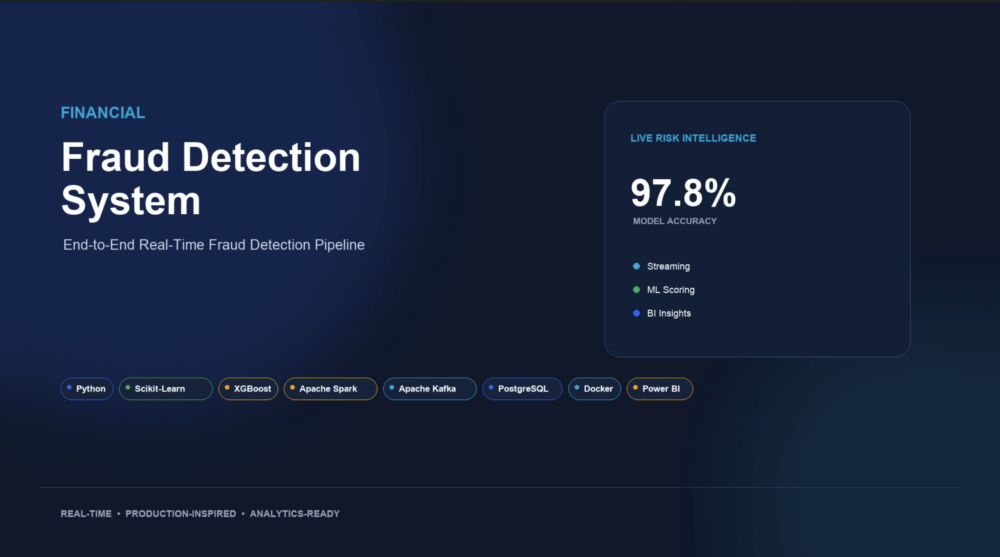
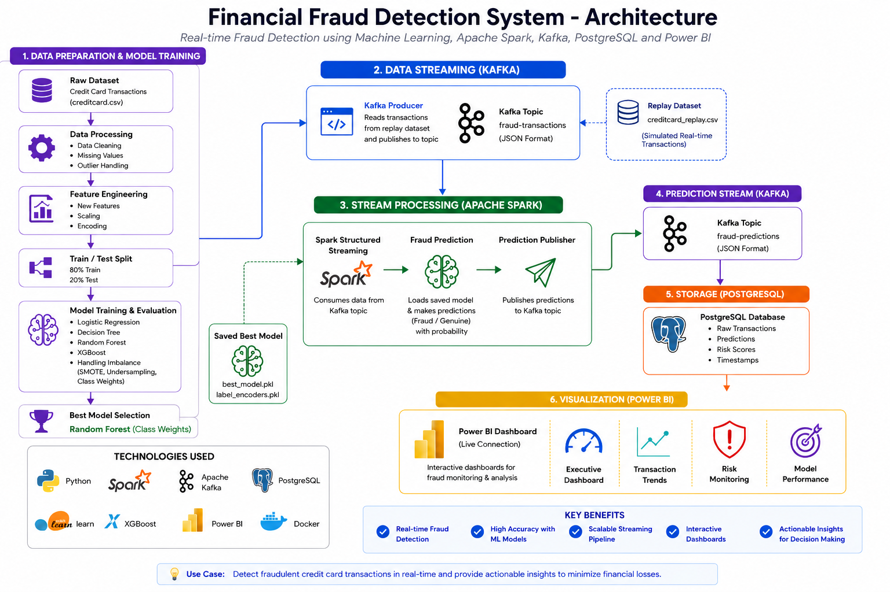
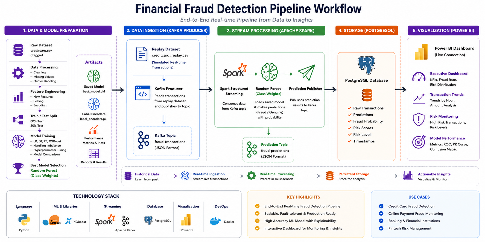

# 💳 Financial Fraud Detection System

<p align="center">
<a href="https://github.com/Yaseen5599/Financial_Fraud_Detection/raw/main/videos/demo.mp4">

</a>

**▶ Click the image to watch the Full HD Demo**
</p>

<div align="center">

## End-to-End Real-Time Financial Fraud Detection using Machine Learning, Apache Spark, Apache Kafka, PostgreSQL, Docker & Power BI

[](https://www.python.org/)
[](https://scikit-learn.org/)
[](https://scikit-learn.org/stable/modules/generated/sklearn.ensemble.RandomForestClassifier.html)
[](https://spark.apache.org/)
[](https://kafka.apache.org/)
[](https://www.postgresql.org/)
[](https://powerbi.microsoft.com/)
[](https://www.docker.com/)
[](LICENSE)

</div>

---

# 📌 Overview

Financial fraud has become one of the biggest challenges for modern banking and digital payment systems. Traditional rule-based approaches often fail to detect sophisticated fraudulent activities in real time.

This project presents a complete **end-to-end real-time Financial Fraud Detection System** that combines **Machine Learning**, **Apache Kafka**, **Apache Spark Structured Streaming**, **PostgreSQL**, **Docker**, and **Power BI** into a production-inspired pipeline.

The system:

- trains and evaluates multiple ML models
- handles highly imbalanced fraud data
- evaluates multiple machine learning models and deploys the best-performing Random Forest (Class Weights) model
- streams transactions through Kafka
- predicts fraud in real time using Spark
- stores predictions in PostgreSQL
- visualizes live insights through interactive Power BI dashboards

---

# ⭐ Repository Highlights

- End-to-End Machine Learning Pipeline
- Real-Time Fraud Detection
- Apache Kafka Streaming
- Apache Spark Structured Streaming
- PostgreSQL Integration
- Explainable AI using SHAP
- Interactive Power BI Dashboard
- Production-inspired Architecture

---

# 🚀 Key Features

### Machine Learning

- Random Forest (Baseline)
- Random Forest (Class Weights) ⭐ Final Production Model
- Random Forest with SMOTE
- Random Forest with Random Undersampling
- XGBoost Model Comparison
- Hyperparameter Tuning
- Best Model Selection

### Real-Time Streaming

- Apache Kafka Producer
- Kafka Topics
- Spark Structured Streaming
- Real-Time Fraud Prediction
- Prediction Publishing

### Data Storage

- PostgreSQL Integration
- Prediction History
- Risk Levels
- Fraud Probability Storage

### Business Intelligence

- Interactive Power BI Dashboard
- Executive Dashboard
- Transaction Trends
- Risk Monitoring
- Model Performance Dashboard

### Explainable AI

- SHAP Global Explainability
- SHAP Local Explainability
- Feature Contribution Analysis
- Transaction-level AI Explainability

---

# 🏗 System Architecture

<p align="center">

</p>

---

# ⚡ End-to-End Pipeline Workflow

<p align="center">

</p>

---

# 🛠 Technology Stack

| Category | Technologies |
|------------|-------------------------------|
| Language | Python |
| Machine Learning | Scikit-Learn (Random Forest), XGBoost |
| Streaming | Apache Kafka |
| Stream Processing | Apache Spark Structured Streaming |
| Database | PostgreSQL |
| Dashboard | Microsoft Power BI |
| Containerization | Docker |
| Development | Jupyter Notebook, VS Code |
| Explainable AI | SHAP |

---

# 📂 Project Structure

```
Financial_Fraud_Detection/

├── notebooks/
├── data/
│   ├── raw/
│   ├── processed/
│   ├── replay/
│   └── external/
│
├── artifacts/
│   ├── plots/
│   ├── reports/
│   ├── shap/
│   └── checkpoints/
│
├── checkpoints/
├── models/
├── powerbi_assets/
├── sql/
├── images/
├── docker-compose.yml
├── requirements.txt
├── README.md
└── LICENSE
```

---

# 🤖 Machine Learning Pipeline

```
Raw Dataset
      │
      ▼
Data Cleaning
      │
      ▼
Feature Engineering
      │
      ▼
Train/Test Split
      │
      ▼
Model Training
      │
      ▼
Hyperparameter Tuning
      │
      ▼
Best Model Selection(Random Forest - Class Weights)
      │
      ▼
Saved Production Model (.pkl)
```
---


# ⚡ Streaming Pipeline

```
Replay Dataset
        │
        ▼
Kafka Producer
        │
        ▼
fraud-transactions
        │
        ▼
Spark Structured Streaming
        │
        ▼
Random Forest (Class Weights)
        │
        ▼
Fraud Prediction
        │
        ▼
fraud-predictions
        │
        ▼
PostgreSQL Database
        │
        ▼
Power BI Dashboard
```

---

# 🏆 Final Production Model

```
Several machine learning approaches were evaluated during this project, including:

- Random Forest (Baseline)
- Random Forest (Class Weights) ✅
- Random Forest with SMOTE
- Random Forest with Random Undersampling
- XGBoost

The final production model was selected after evaluating multiple algorithms using:

- Accuracy
- Precision
- Recall
- F1 Score
- ROC-AUC
- Balanced Accuracy
- Matthews Correlation Coefficient
- Log Loss

Random Forest with Class Weights achieved the best overall balance between fraud detection performance, robustness on imbalanced data, inference speed, and suitability for real-time deployment.
```
---

# 📊 Power BI Dashboard

## Executive Dashboard

<p align="center">

</p>

Features:

- Total Transactions
- Fraud Transactions
- Fraud Rate
- Average Transaction Amount
- Prediction Distribution
- Risk Distribution

---

## Transaction Trends

<p align="center">

</p>

Includes:

- Transactions by Hour
- Amount by Hour
- Fraud Probability Trend
- Detailed Transaction Table

---

## Risk Monitoring

<p align="center">

</p>

Includes:

- Risk Distribution
- Fraud Probability Histogram
- Top Risk Transactions
- Fraud Investigation Table

---

## Model Performance

<p align="center">

</p>

Includes:

- Precision
- Recall
- F1 Score
- ROC-AUC
- ROC Curve
- Precision-Recall Curve
- Confusion Matrix
- Performance Metrics

---

# 📈 Model Performance

| Metric | Score |
|----------|--------:|
| Accuracy | 99.95% |
| Precision | 95.83% |
| Recall | 72.63% |
| F1 Score | 82.63% |
| ROC-AUC | 94.39% |
| Balanced Accuracy | 86.31% |
| Matthews Correlation | 83.41% |
| Log Loss | 0.008 |

---

# 🧠 AI Explainability Center

<p align="center">

</p>

Features:

- Transaction-level Explainability
- SHAP Feature Contributions
- Fraud Probability
- Prediction
- Actual Class
- Risk Level
- Recommendation
- Local Feature Importance
- Offline Test Dataset Analysis

---

## 🔍 Explainability Outputs

Notebook 24 generates multiple explainability artifacts, including:

- SHAP Global Feature Importance
- SHAP Beeswarm Plot
- Transaction Explainability Report
- Executive Explainability Summary
- Model Card
- Feature Importance Rankings
- Power BI Explainability Assets

---

# 📌 Project Outcomes

✔ Built an end-to-end fraud detection pipeline from data preprocessing to deployment.

✔ Integrated Apache Kafka, Apache Spark Structured Streaming, PostgreSQL, Docker, and Power BI into a production-inspired workflow.

✔ Evaluated multiple machine learning models and selected Random Forest (Class Weights) as the production model.

✔ Implemented Explainable AI using SHAP for transaction-level interpretation.

✔ Achieved 99.95% Accuracy and 94.39% ROC-AUC on a highly imbalanced fraud dataset.

---

# 🔄 Real-Time Pipeline

```
Historical Dataset
        │
        ▼
Replay Producer
        │
        ▼
Kafka
        │
        ▼
Spark Streaming
        │
        ▼
Fraud Prediction
        │
        ▼
Kafka Prediction Topic
        │
        ▼
PostgreSQL
        │
        ▼
Power BI Live Dashboard
```

---

# ⚙ Installation

```bash
git clone https://github.com/Yaseen5599/Financial_Fraud_Detection.git

cd Financial_Fraud_Detection

python -m venv .venv

source .venv/bin/activate     # macOS/Linux

.venv\Scripts\activate        # Windows

pip install -r requirements.txt
```

---

# ▶ Running the Project

### 1. Start Docker

```bash
docker compose up -d
```

### 2. Start Replay Producer

Run Notebook **23**

---

### 3. Run Prediction Pipeline

Run Notebook **18**

---

### 4. Store Predictions

Run Notebook **20**

---

### 5. Refresh Power BI

Open the Power BI report and click **Refresh** to display the latest predictions from PostgreSQL.

---

# 💡 Future Enhancements

- FastAPI REST API
- Dockerized API Service
- Kubernetes Deployment
- AWS Cloud Deployment
- CI/CD Pipeline
- Model Drift Detection
- Automated Retraining
- Real-Time SHAP Explainability
- Grafana Monitoring

---

# 📊 Dashboard Architecture

The Power BI report consists of two complementary analytics pipelines.

### Operational Dashboard

The following pages visualize real-time fraud predictions generated by the Kafka → Spark → PostgreSQL pipeline:

- Executive Dashboard
- Transaction Trends
- Risk Monitoring
- Model Performance

These pages use transaction records stored in PostgreSQL.

### AI Explainability Center

The AI Explainability Center is built using SHAP explainability results generated from the offline test dataset (X_test).

It demonstrates how the trained Random Forest model makes predictions by displaying the most influential features contributing to each transaction.

The transaction identifiers on this page belong to the offline evaluation dataset and are intentionally separate from the PostgreSQL transaction IDs used by the operational dashboards.

---

# 📜 License

This project is licensed under the MIT License.

---

# 👨‍💻 Author

**AHMAD YASEEN S**

**GitHub**

https://github.com/Yaseen5599

**LinkedIn**

https://www.linkedin.com/in/ahmad-yaseen-s-a82441334/

---

## ⭐ If you found this project useful, consider giving it a star!