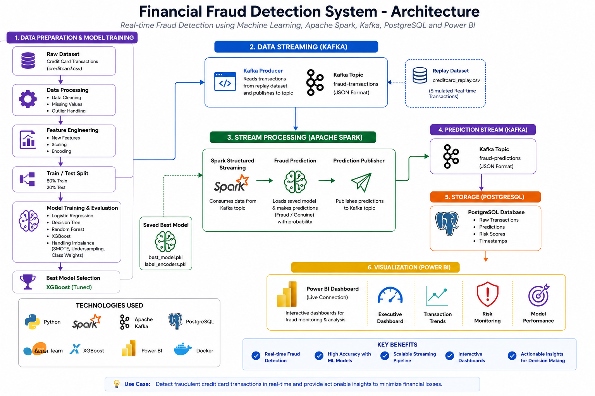

# 💳 Financial Fraud Detection System

<p align="center">
<a href="https://github.com/Yaseen5599/Financial_Fraud_Detection/raw/main/videos/demo.mp4">

</a>

**▶ Click the image to watch the Full HD Demo**
</p>

<div align="center">

## End-to-End Real-Time Financial Fraud Detection using Machine Learning, Apache Spark, Apache Kafka, PostgreSQL, Docker & Power BI

[](https://www.python.org/)
[](https://scikit-learn.org/)
[](https://xgboost.readthedocs.io/)
[](https://spark.apache.org/)
[](https://kafka.apache.org/)
[](https://www.postgresql.org/)
[](https://powerbi.microsoft.com/)
[](https://www.docker.com/)
[](LICENSE)

</div>

---

# 📌 Overview

Financial fraud has become one of the biggest challenges for modern banking and digital payment systems. Traditional rule-based approaches often fail to detect sophisticated fraudulent activities in real time.

This project presents a complete **end-to-end real-time Financial Fraud Detection System** that combines **Machine Learning**, **Apache Kafka**, **Apache Spark Structured Streaming**, **PostgreSQL**, **Docker**, and **Power BI** into a production-inspired pipeline.

The system:

- trains and evaluates multiple ML models
- handles highly imbalanced fraud data
- selects the best-performing model
- streams transactions through Kafka
- predicts fraud in real time using Spark
- stores predictions in PostgreSQL
- visualizes live insights through interactive Power BI dashboards

---

# 🚀 Key Features

### Machine Learning

- Exploratory Data Analysis
- Feature Engineering
- Handling Imbalanced Data
- Random Forest
- XGBoost
- Hyperparameter Tuning
- Best Model Selection
- Model Serialization

### Real-Time Streaming

- Apache Kafka Producer
- Kafka Topics
- Spark Structured Streaming
- Real-Time Fraud Prediction
- Prediction Publishing

### Data Storage

- PostgreSQL Integration
- Prediction History
- Risk Levels
- Fraud Probability Storage

### Business Intelligence

- Interactive Power BI Dashboard
- Executive Dashboard
- Transaction Trends
- Risk Monitoring
- Model Performance Dashboard

---

# 🏗 System Architecture

<p align="center">

</p>

---

# ⚡ End-to-End Pipeline Workflow

<p align="center">

</p>

---

# 🛠 Technology Stack

| Category | Technologies |
|------------|-------------------------------|
| Language | Python |
| Machine Learning | Scikit-Learn, XGBoost |
| Streaming | Apache Kafka |
| Stream Processing | Apache Spark Structured Streaming |
| Database | PostgreSQL |
| Dashboard | Microsoft Power BI |
| Containerization | Docker |
| Development | Jupyter Notebook, VS Code |

---

# 📂 Project Structure

```
Financial_Fraud_Detection/

├── notebooks/
│   ├── Data Preprocessing
│   ├── Model Training
│   ├── Kafka Streaming
│   ├── Spark Prediction
│   ├── PostgreSQL Writer
│   └── Power BI Assets
│
├── data/
│   ├── raw/
│   ├── processed/
│   ├── replay/
│   └── external/
│
├── models/
│
├── powerbi_assets/
│
├── sql/
│
├── results/
│
├── images/
│
├── docker-compose.yml
├── requirements.txt
└── README.md
```

---

# 🤖 Machine Learning Pipeline

```
Raw Dataset
      │
      ▼
Data Cleaning
      │
      ▼
Feature Engineering
      │
      ▼
Train/Test Split
      │
      ▼
Model Training
      │
      ▼
Hyperparameter Tuning
      │
      ▼
Best Model Selection
      │
      ▼
Saved Model (.pkl)
```

---

# ⚡ Streaming Pipeline

```
Replay Dataset
        │
        ▼
Kafka Producer
        │
        ▼
fraud-transactions
        │
        ▼
Spark Structured Streaming
        │
        ▼
Fraud Prediction
        │
        ▼
fraud-predictions
        │
        ▼
PostgreSQL Database
        │
        ▼
Power BI Dashboard
```

---

# 📊 Power BI Dashboard

## Executive Dashboard

<p align="center">

</p>

Features:

- Total Transactions
- Fraud Transactions
- Fraud Rate
- Average Transaction Amount
- Prediction Distribution
- Risk Distribution

---

## Transaction Trends

<p align="center">

</p>

Includes:

- Transactions by Hour
- Amount by Hour
- Fraud Probability Trend
- Detailed Transaction Table

---

## Risk Monitoring

<p align="center">

</p>

Includes:

- Risk Distribution
- Fraud Probability Histogram
- Top Risk Transactions
- Fraud Investigation Table

---

## Model Performance

<p align="center">

</p>

Includes:

- Precision
- Recall
- F1 Score
- ROC-AUC
- ROC Curve
- Precision-Recall Curve
- Confusion Matrix
- Performance Metrics

---

# 📈 Model Performance

| Metric | Score |
|----------|--------:|
| Accuracy | 99.95% |
| Precision | 95.83% |
| Recall | 72.63% |
| F1 Score | 82.63% |
| ROC-AUC | 94.39% |
| Balanced Accuracy | 86.31% |
| Matthews Correlation | 83.41% |
| Log Loss | 0.008 |

---

# 🔄 Real-Time Pipeline

```
Historical Dataset
        │
        ▼
Replay Producer
        │
        ▼
Kafka
        │
        ▼
Spark Streaming
        │
        ▼
Fraud Prediction
        │
        ▼
Kafka Prediction Topic
        │
        ▼
PostgreSQL
        │
        ▼
Power BI Live Dashboard
```

---

# ⚙ Installation

```bash
git clone https://github.com/your-username/Financial_Fraud_Detection.git

cd Financial_Fraud_Detection

pip install -r requirements.txt
```

---

# ▶ Running the Project

### 1. Start Docker

```bash
docker compose up -d
```

### 2. Start Replay Producer

Run Notebook **23**

---

### 3. Run Prediction Pipeline

Run Notebook **18**

---

### 4. Store Predictions

Run Notebook **20**

---

### 5. Refresh Power BI

Open the Power BI report and click **Refresh** to display the latest predictions from PostgreSQL.

---

# 💡 Future Enhancements

- REST API using FastAPI
- Kubernetes Deployment
- AWS Deployment
- CI/CD Pipeline
- Email Fraud Alerts
- SMS Notifications
- Grafana Monitoring
- Automated Model Retraining
- Explainable AI Dashboard

---

# 📜 License

This project is licensed under the MIT License.

---

# 👨‍💻 Author

**AHMAD YASEEN S**

**GitHub**

https://github.com/Yaseen5599

**LinkedIn**

https://www.linkedin.com/in/ahmad-yaseen-s-a82441334/

---

## ⭐ If you found this project useful, consider giving it a star!